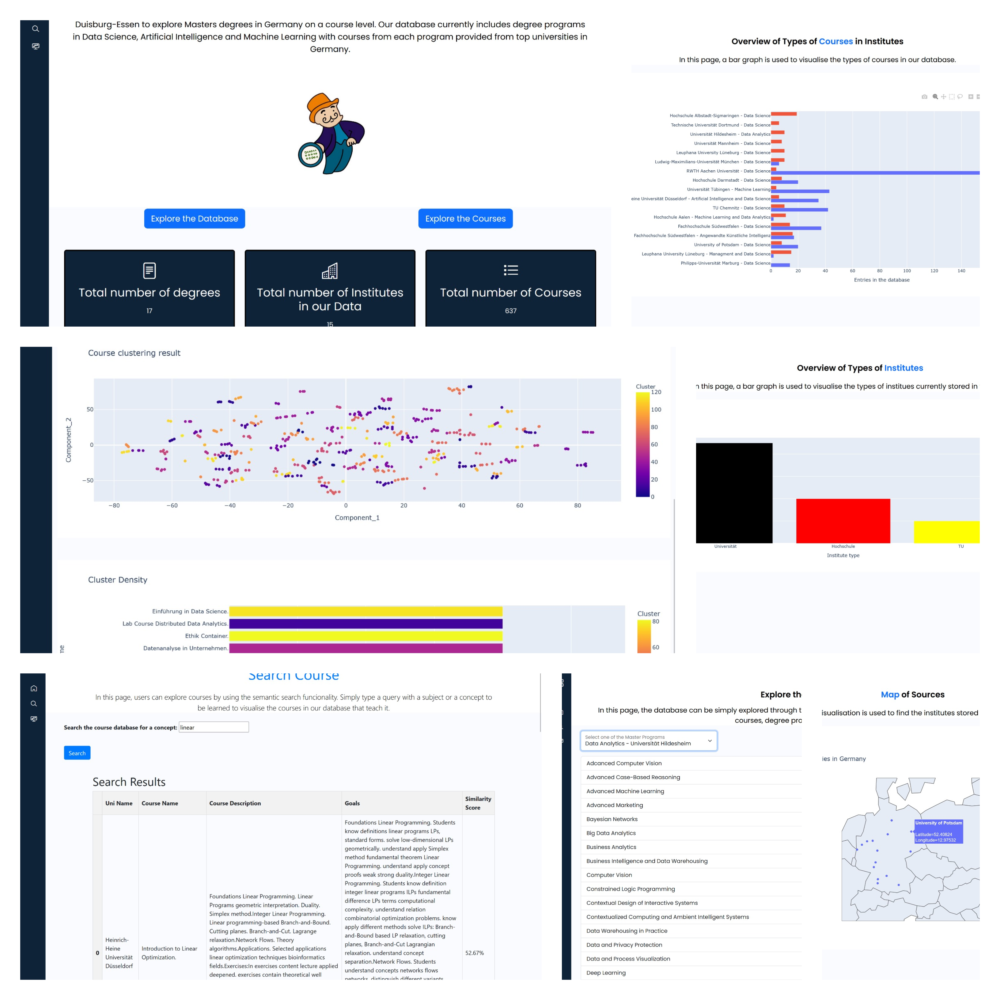
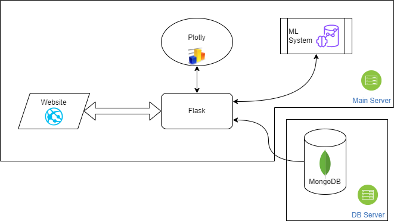

<h1 align="center" > MEOW 🐱🎓🔍 </h1> 
<p align="center">
Master Exploration & Overview Webapp
</p>
<p align="center">
  <a href="https://www.youtube.com/watch?v=Hkf_qIQe2ho">Video Demo 📽️</a> - <a href="http://DCMeow.com">Live Website 💻</a> - <a href="https://docs.google.com/spreadsheets/d/1Eqi7FPpZVEH2Zml3lw1Dp8DSu7Kk7k2RTP5U2CdApSo/edit?usp=sharing"> Dataset 📃</a>
</p>

<!--  -->
<p align="center">
   
</p>
<p align="center">
 

MEOW is an explorative web application that allows you to explore AI and data science study degrees in Germany. It was implemented in order to support students in the choice of AI and DS study degrees as well as to support the establishment of new study degrees in these fields.
</p>


## Running the Database 

You can use a local or remote MongoDB database to run the project.

### Using the remote MongoDB
##### Note: Using the `.env` file that was provided separately.

  - Move the `.env` file to the root of the project (same level as `app.py`) \

Note: The remote database is up to date. No need to run the `update_database.py` file.

### Using a Local MongoDB


  1. Install MongoDB on your Machine \
    - [MongoDB Installation](https://www.mongodb.com/docs/manual/installation/
)


  2. Start MongoDB (Modify `config.py` parameters if needed, such as local port number) 

  3. Update/Fill Database with Data\
    - Run the `update_database.py` file to fill the database with the data from the Google Datasheet\
    - `python update_database.py`
  Create a Database called `ai_masters_germany`


## Usage

Clone the project

```bash
  git clone https://github.com/MarwanMabrouk/AI-Masters-Germany.git
```

Go to the project directory

```bash
  cd AI-Masters-Germany
```

Install dependencies

```bash
  pip install -r requirements.txt
```

Start the project

```bash
  python app.py
```

## Deployment / Live Demo

The website is deployed on a server and can be accessed through the following link: [DCMeow.com](http://DCMeow.com)
It is automatically updated with the latest changes from the main branch using GitHub Webhooks.

## Screenshots



## Video Demo

Link to the video demonstration: [YouTube](https://www.youtube.com/watch?v=Hkf_qIQe2ho)

https://github.com/MarwanMabrouk/AI-Masters-Germany/assets/48681637/f4545a9b-69e1-47ed-812c-cbea9920d9c1


## Tech Stack

**Frontend :** Flask Templates, Bootstrap\
**Backend :** Flask\
**Visualizations :** Plotly\
**Database :** MongoDB\
**Design :** Figma (not integrated in the final website) 

## Architecture



## Known Issues/Limitations

- The course clustering takes up to 3 min to be ready after starting the website.
- Similarity calculation takes up to 1 min, but only for the first request.
- The used models require 3 to 4 GB of RAM.

## Authors
The Data Connoisseurs
- [@Ula-MK](https://github.com/Ula-MK)
- [@mohabdelmagied](https://github.com/mohabdelmagied)
- [@nikabogd](https://github.com/nikabogd)
- [@khoffschlag](https://github.com/khoffschlag)
- [@MarwanMabrouk](https://github.com/MarwanMabrouk)
- [@mffriaslorite](https://github.com/mffriaslorite)


