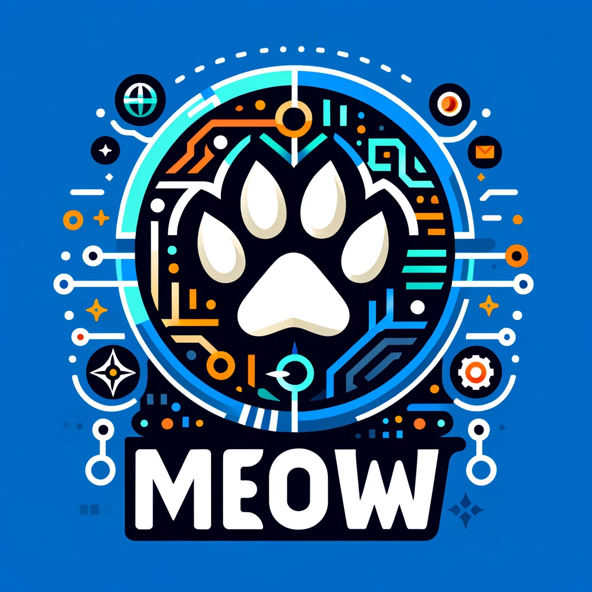

# MEOW 🐱🎓🔍
Master Exploration & Overview Webapp




## Usage

Clone the project

```bash
  git clone https://github.com/MarwanMabrouk/AI-Masters-Germany.git
```

Go to the project directory

```bash
  cd AI-Masters-Germany
```

Install dependencies

```bash
  pip install -r requirements.txt
```

Start Flask

```bash
  flask run
```


## Tech Stack


**Frontend :** Flask Templates, Bootstrap\
**Backend :** Flask\
**Visualizations :** Plotly\
**Database :** MongoDB\
**Design :** Figma (not integrated)


## Authors
The Data Connoisseurs
- [@Ula-MK](https://github.com/Ula-MK)
- [@mohabdelmagied](https://github.com/mohabdelmagied)
- [@nikabogd](https://github.com/nikabogd)
- [@khoffschlag](https://github.com/khoffschlag)
- [@MarwanMabrouk](https://github.com/MarwanMabrouk)
- [@mffriaslorite](https://github.com/mffriaslorite)


